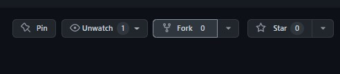
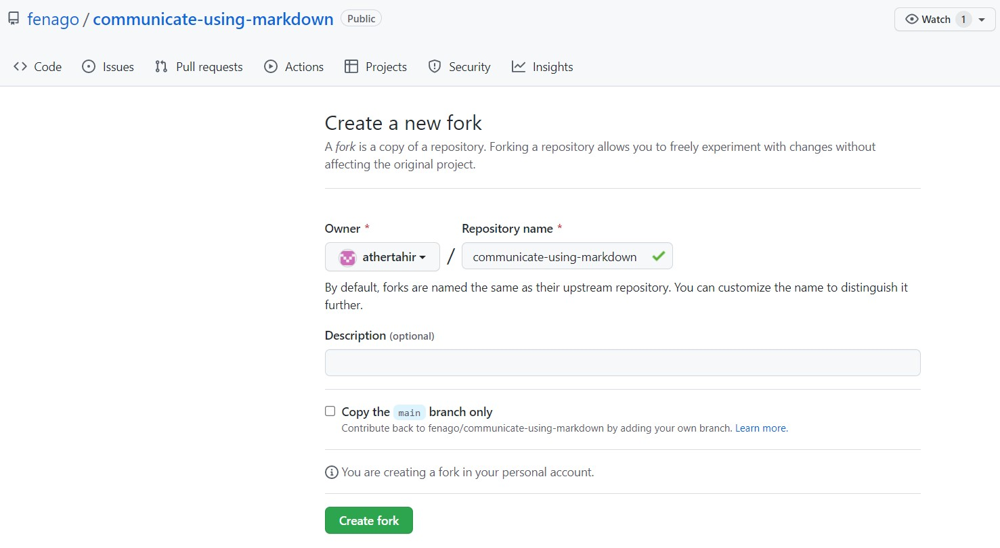
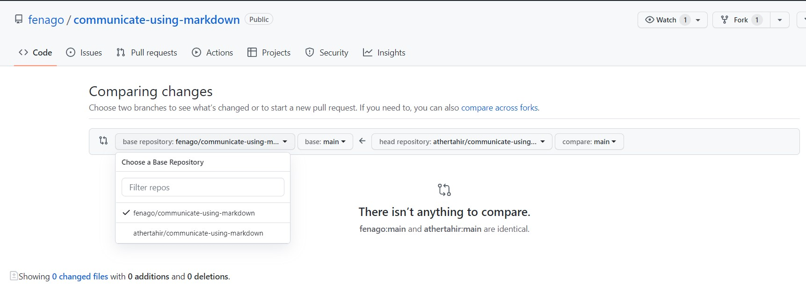
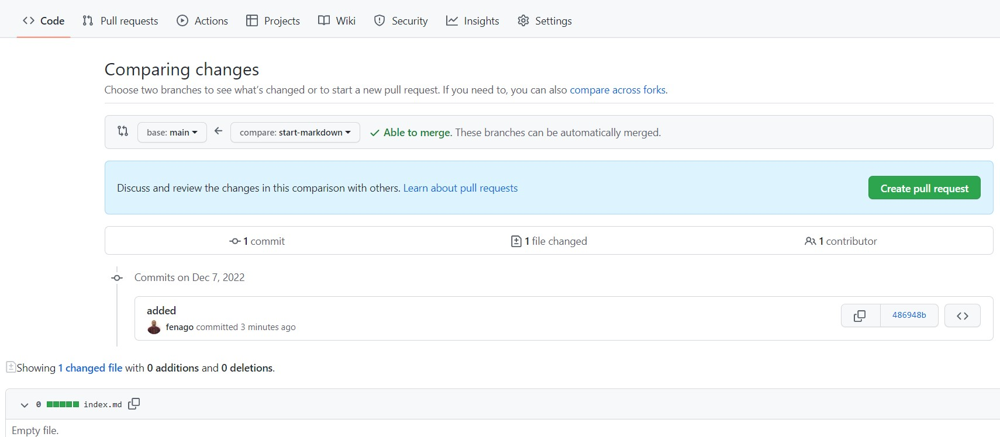
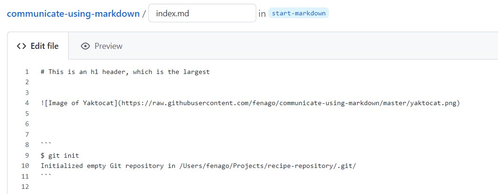

# Communicate using Markdown

_Organize ideas and collaborate using Markdown, a lightweight language for text formatting._


GitHub is about more than code. It’s a platform for software collaboration, and Markdown is one of the most important ways developers can make their communication clear and organized in issues and pull requests. This course will walk you through creating and using headings more effectively, organizing thoughts in bulleted lists, and showing how much work you’ve completed with checklists. You can even use Markdown to add some depth to your work with the help of emoji, images, and links.

- **Who is this for**: New developers, new GitHub users, and students.
- **What you'll learn**: Use Markdown to add lists, images, and links in a comment or text file.
- **What you'll build**: We'll update a plain text file and add Markdown formatting, and you can use this file to start your own GitHub Pages site.
- **How long**: This course is five steps long and takes less than one hour to complete.

## How to start this course

1. Open following URL in browser, click **Fork** and open the link in a new tab.
   `https://github.com/fenago/communicate-using-markdown`

   
2. In the new tab, follow the prompts to create a new repository.
   - For owner, choose your personal account or an organization to host the repository.
   - **Important! Make sure to uncheck box `Copy the main branch only`**.
    
3. After your new repository is created, wait about 20 seconds, then refresh the page. Follow the step-by-step instructions in the new repository's README.


### Activity: Open pull request

1. Create new **pull request** to merge `start-markdown` branch into `main`.
1. Make sure to select your repository while creating pull request as `base` repository.





<summary><h2>Step 1: Add headers</h2></summary>

_Welcome to "Communicate using Markdown"!

**What is _Markdown_?** Markdown is a `lightweight syntax` for communicating on GitHub. You can format text to add heading, lists, **bold**, _italics_, tables, and many other stylings. You can use Markdown most places around GitHub:

- Comments in issues, pull requests, and discussions
- Files with the `.md` or `.markdown` extension
- Sharing snippets of text in `Gists`

**What is a _header_?** A header is a larger bit of text at the beginning of a section. There are six sizes.

### Example

```txt
# This is an <h1> header, which is the largest
## This is an <h2> header
###### This is an <h6> header, which is the smallest
```

#### How it looks

# This is an `<h1>` header, which is the largest
## This is an `<h2>` header
###### This is an `<h6>` header, which is the smallest

### Activity: Edit your file with headers

1. Open a new browser tab, and work on the steps in your second tab while you read the instructions in this tab.
1. Open the **pull requests** tab.
1. Open the pull request we made for you.
1. In this pull request, go to the **Files changed** tab.
1. Select **Edit file** from the three dotted **...** menu in the upper right corner of the file view on `index.md`.
1. On the **Edit file** tab, add a `#`, followed by a **space**, before the content to make it an H1 Header. You can add more headers, using one to six `#` characters followed by a **space**.
1. Above your new content, click **Preview**.
1. At the bottom of the page, type a short, meaningful commit message that describes the change you made to the file.
1. Click **Commit changes**.


<summary><h2>Step 2: Add an image</h2></summary>

_Great job adding headers to the file :sparkles:_

Let's add an image. Include descriptive text in the square brackets. This text is read aloud for people using screen readers. It's also shown at times when your image doesn't display, such as when there's a poor connection. You can see the syntax for images below:

### Example

```md

```

#### How it looks


### Activity: Adding an image

1. As you did before, edit the `index.md` file in this pull request.
1. In the file, add the correct Markdown for your image of choice. Don't forget to include alt-text!
1. Use the **Preview** tab to check your Markdown formatting.
1. Commit your changes.
1. Wait about 20 seconds then refresh this page for the next step.


<summary><h2>Step 3: Add a code example</h2></summary>

_Great job adding an image to the file :tada:_

In addition to code blocks, some code blocks should be rendered differently depending on the language, such as JavaScript or command-line text.

### Example

<pre>
```
$ git init
Initialized empty Git repository in /Users/fenago/Projects/recipe-repository/.git/
```
</pre>

#### How it looks

```
$ git init
Initialized empty Git repository in /Users/fenago/Projects/recipe-repository/.git/
```

### Activity: Adding a code example

1. As you did before, edit the file in this pull request.
1. In the file, add the correct Markdown for a code example of your choice.
1. Use the **Preview** tab to check your Markdown formatting.
1. Commit your changes.




<summary><h2>Step 4: Make a task list</h2></summary>

_Great job adding a code example to the file :partying_face:_

**What is a _task list_?** A task list creates checkboxes to check off. They're very useful for tracking issues and pull requests. If you include a task list in the body of an issue or pull request, you'll see a progress indicator in your issue list. The syntax for task lists is very specific. Be sure to include the spaces where required, or else they won't render.

### Example

```
- [x] List syntax is required
- [x] This item is complete
- [ ] This item is not complete
```

#### How it looks

- [x] List syntax is required
- [x] This item is complete
- [ ] This item is not complete

### Activity: Add a task list

GitHub Actions went ahead and made a branch and a pull request for you. So you'll need to add to the file we've created in the branch, and we will check your work as you work through this course!

1. Return to your pull request.
1. Use Markdown to create a task list. Here is an example:

   ```md
   - [ ] Turn on GitHub Pages
   - [ ] Outline my portfolio
   - [ ] Introduce myself to the world
   ```

   Remember, a task list starts with the syntax `- [ ]` and then the task list item. The formatting is specific!

1. Use the **Preview** tab to check your Markdown formatting.
1. Commit the changes to the file.


<summary><h2>Step 5: Merge your pull request</h2></summary>

_Great job adding a task list to the file

You can now `merge` your pull request!

### Activity: Merge your pull request

1. Click **Merge pull request**.


<summary><h2>Finish</h2></summary>

_Congratulations , you've completed this course!_

Here's a recap of all the tasks you've accomplished in your repository:

1. You learned about Markdown, headings, images, code examples, and task lists.
1. You created and merged a Markdown file.

